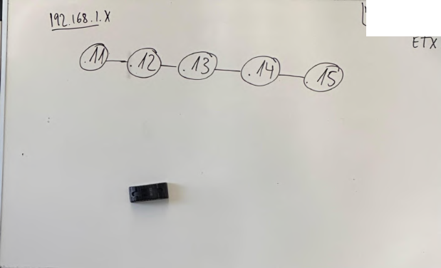
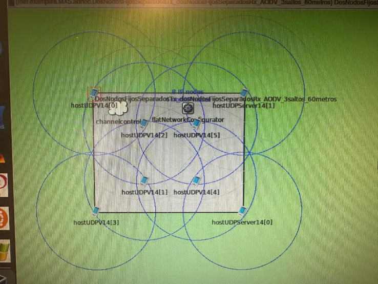

# Wireless Multihop Network: OLSR and AODV

Team laboratory project completed for **Mobilitat, Xarxes i Serveis** at **UPC - EETAC**, May 2026. The work explored wireless multihop communication through simulations and university laboratory experiments, with a rescue-team communication scenario as the application context.

[Read the project report](report/wireless-multihop-network-report.pdf)

## Experiments

- **Simulation:** examined throughput across one- to four-hop paths, competing traffic flows, and an extended network topology in OMNeT++/INET.
- **OLSR:** configured Linux wireless nodes and MAC-address-based filtering with iptables, inspected neighbors and routing information, and measured ping round-trip times.
- **AODV:** repeated connectivity and round-trip-time experiments and discussed route discovery and recovery after a link failure.

**Tools:** OMNeT++, INET, Linux, iptables, iwconfig, arp, ping, olsrd, aodvd.

## Network scenarios

Five-node laboratory chain. Extracted from Figure 17, printed page 14 of the report; a password note has been redacted.

Extended simulation topology. Original photograph from Figure 12, printed page 11 of the report.

## Selected results

The report describes the following approximate throughput values for the single-flow simulation scenarios:

| Path length | Reported throughput |
| --- | --- |
| 1 hop | 23 Mbps |
| 2 hops | 12 Mbps |
| 3 hops | 7 Mbps |
| 4 hops | 5-6 Mbps |

These values summarize the reported runs (printed pages 4-8), rather than a general capacity formula for multihop networks.

The laboratory measurements also showed variation in round-trip time. For example, the OLSR measurements from node 15 had average RTTs of 0.825, 11.073, 4.133 and 3.601 ms to nodes 14, 13, 12 and 11 respectively (printed page 22). The averages therefore did not increase consistently with path length in that run.

## Interpretation and available material

The experiments were performed on university computers using virtual machines. The original simulation files, configuration files and raw measurement logs were not retained. This repository contains the report and selected figures; it does not include a runnable reproduction of the laboratory environment.

The report favors AODV for its rescue-network scenario. Its approximately **2.7-second AODV recovery result was supplied by the professor**, as stated on printed pages 38-40. It should not be attributed to a recovery measurement made by the team, despite the wording in the conclusion. The reported comparison is specific to the laboratory setup and does not establish that AODV is always preferable to OLSR.

The measurements are ping **round-trip times**, rather than one-way delays. The report's comparison with a 150 ms threshold is not, by itself, a validation of voice or video service quality.

The report is preserved as submitted, apart from redacting a password note visible in one photograph. Its screenshots include course-provided instructions and configurations.

## Team

Authors, as credited in the report:

- Daniel Ceron Espinosa
- Sayna Kiani
- Ali Mehrabikouchehbiouk (Ali Mehrabi)
- Alejandro Valle Gonzalez

The laboratory work was carried out collaboratively throughout the project. This repository presents the shared team work as part of Ali Mehrabi's portfolio.

**Instructor:** Carles Gomez Montenegro  
**Report date:** 23 May 2026
